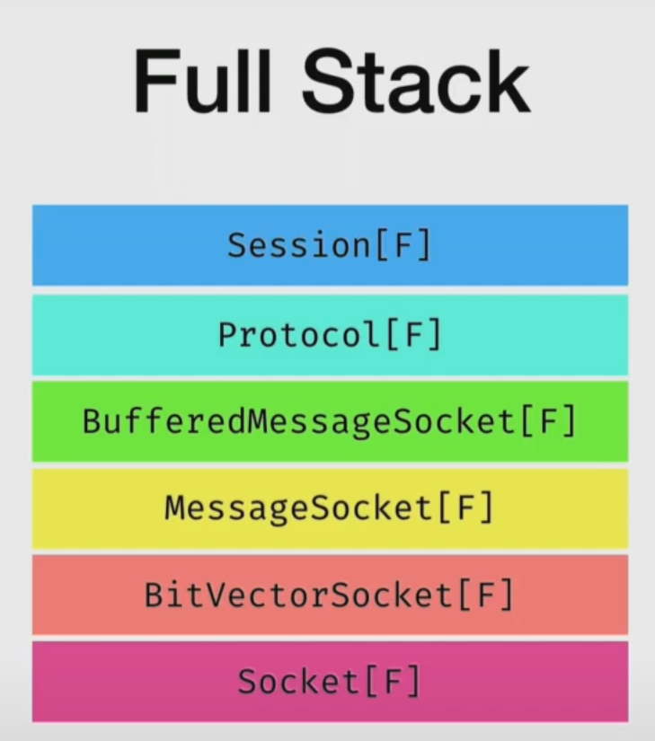

# DB tools comparison
<!-- markdownlint-disable MD033 -->

Let's compare [Skunk](https://typelevel.org/skunk/) vs [Doobie](https://tpolecat.github.io/doobie/) db tools for Scala.

So, in order to do it, I am going to cover the following points:

* Consider main difference - doobie that is using jdbc vs skunk that is using pure postgresql protocol;
* Try to work with benchmarks
  * Understand what kind of benchmarks we need for comparison:
    * Compile time benchmarks;
    * Execution time benchmarks;
  * Choose tools for performing benchmarks;
* Create an example project for Skunk and Doobie;
* Compare query building, transactions, sessions pools and any tools for them, error logging;
* Try to work with ltree structure;

## JDBC vs pure PostgreSQL protocol

Doobie is a pure functional JDBC library. This is a great library but it still has some minuses:

* Using JDBC;
* Bad diagnostics (partly due to JDBC, partly due to Doobie);
* Auto-derivation of row codecs is probably bad - takes a long time to derive things we want;

Skunk tries to solve these problems for PostgreSQL database:

* Speals the wire protocol directly (no driver, no indirection);
* Completly non-blocking (we don't have to worry about thread pools). All message handling is asynchronous;
* API mirrors the operational semantics of Postgres;
* Beautiful and comprehensive error reporting;
* Build with cats, cats-effect, fs2, scodec;

### Talking with PostgreSQL

Communication with PostgreSQL happens via a TCP Socket connection by exchanging byte array messages:


And it's documented in PostgreSQL documentation - [Chapter 55. Frontend/Backend Protocol](https://www.postgresql.org/docs/current/protocol.html)

So, after reading the PostgreSQL documantation, if we try to implement communication with DB without JDBC, we probably go through the following steps:

1. Get a tool for communication via TCP by socket - [fs2.io.tcp.Socket](https://www.javadoc.io/doc/co.fs2/fs2-io_3/latest/index.html);
2. To read and write raw data (bytes) from PostgreSQL, implement a BitVectorSocket (use scodec for conversions);
3. Implement logic for reading different types of messages from PostgreSQL
   message = tag (1 byte) + length (4 bytes) + payload (<lenght> - 4 bytes)
4. Test implementation - start communication with PostgreSQL with a StartUp message (in order to get a DB session);
5. Go to the next abstraction level - implement `MessageSocket` ([skunk.net.MessageSocket](https://www.javadoc.io/doc/org.tpolecat/skunk-core_3/latest/index.html)) that speaks in terms of PostgreSQL messages;

At the end of implementation, a stack will look like this:



### End User API

TBD

* [ ] Add a couple of demo examples;
* [ ] Mention and demonstrate ltree schema type;

<font size = "2">This section is based on Rob Norris [talk](https://www.youtube.com/watch?v=NJrgj1vQeAI) on Scala Days 2019 about Skunk</font>

---

TBD

* [ ] Check out materials about Skunk in the book [Practical FP in Scala](https://leanpub.com/pfp-scala) by [Gabriel Volpe](https://twitter.com/volpegabriel87).

Check out these links found on the internet while searching Skunk vs Doobie:

* [ ] Investigate this - <https://www.libhunt.com/compare-skunk-vs-doobie>
* [ ] and this - <https://www.baeldung.com/scala/skunk-postgresql-driver>

Check out these materials from a DevInsideYou Scala blogger:

* [ ] <https://youtu.be/J5I_HEUKsF0?si=2-d4PWO9ZhiBPPCH>
* [ ] <https://youtu.be/kafn3qKd9Pw?si=7rq6qZnrPVe4sXAw>

Think about these questions:

* Why has there been no more info about Skunk since 2021?
* Why do we not have much information about Skunk?
* Do we know some projects that are using Skunk?
* Can we use the ltree schema type from Skunk in Doobie?

## Benchmarks

[Typo](https://oyvindberg.github.io/typo/) has a blog with the following [article](https://oyvindberg.github.io/typo/blog/the-cost-of-implicits). It compares [Skunk](https://typelevel.org/skunk/) vs [Doobie](https://tpolecat.github.io/doobie/) DB tools for Scala and describes compile-time benchmarks.

Personally, I'm not sure that these benchmarks are correct due to the following reasons:

* using only a timestamp as a test parameter;
* timestamp cost might be greater than the actual compile work;
* benchmarks run only 3 times;
* benchmarks run without warm-ups;
* [bleep](https://bleep.build/docs/my-build-does-more/) building tool is used, but not the widely used [sbt](https://www.scala-sbt.org/);

From my point of view, we have to use best practices that have been tested a long time ago and have proven their reliability. I'm talking about *Java Microbenchmark Harness* (JMH).

In order to write benchmarks in a correct way, we have to count many things, and it definitely hard work to write a correct benchmark. Aleksei Shipilev greatly described what we must know while trying to write correct benchmarks [here](https://shipilev.net/blog/2014/nanotrusting-nanotime/). Also, you can check out his talk [here](https://www.youtube.com/watch?v=8pMfUopQ9Es).

After investigation of these materials, I decided to use JMH for writing benchmarks to compare Skunk and Doobie. Another question: what do we want to compare? I think the first thing we have to compare is compile-time, as it was done in the Typo article. The second thing is the performance of fetching results from a DB.

Summing it up, we want to test the following things:

* compile time;
* performance of fetching data records (this point is under the question; maybe it isn't worth to test it because we might test only DB's performance but not the performance of the db tools - so this point have to be considered additionally before implementing it);
  * Memory benchmark? (<https://github.com/sbt/sbt-jmh#using-java-flight-recorder--async-profiler>);
  * Garbage collector and how much cleaning was done (add `-prof gc` while running a benchmark);

In order to write benchmarks for Scala using JMH, we can use the following tools:

* [sbt-jmh](https://github.com/sbt/sbt-jmh) - to measure performance;
* [compiler-benchmark](https://github.com/scala/compiler-benchmark) - to measure compile time;

For compile-time benchmarks, I am going to count and play with these parameters:

* java versions/graal vm;
* Scala versions 2.12, 2.13, 3;
* different DB tools - Doobie (considering different jdbc drivers) vs Skunk;
* different query tests/examples (considering corner cases with empty queries), including ltrees;

At this moment, there is only one sample - [Hello World](./db-benchmarks/src/main/scala/ru/fscala/dbtool/JMHSample_01_HelloWorld.scala) benchmark.
The other expected benchmarks will be added a bit later.

As for now, in demonstration purposes, to run the "Hello World" benchmark use the following command:

```shell
sbt 'db-benchmarks/Jmh/run -i 1 -wi 1 -f 1 -rf csv .*Hello.*'
```

## Example project

There is an example project for Skunk and Doobie - <https://github.com/AlekseiLitkovetc/db-tools-comparison>

TBD:

* [ ] Compare basic syntax Doobie vs Skunk;
* [x] Add query examples for Skunk and investigate its API;
* [ ] Add similar examples for Doobie;
* [x] Do exercises from the Skunk tutorial <https://typelevel.org/skunk/tutorial/> and check how errors are logged;
* [ ] After that, do the same with Doobie and check its error logging logic (does it exist?);
* [ ] Compare update many from Doobie vs Skunk (does Skunk allow to make a SQL injection?);
* [ ] Compare Doobie approach for connection pool vs Skunk (does it have it?);

### Skunk runtime errors

Play with the code block in [Experiments.scala](./db-examples/src/main/scala/ru/fsacala/dbtool/skunk/Experiments.scala#L52) - `experiment02` to face with errors like these (or others):

<details>
  <summary>[error] Exactly one row was expected, but more were returned</summary>
  
  ```text
  [error] skunk.exception.SkunkException:
  [error] 🔥  
  [error] 🔥  Skunk encountered a problem related to use of unique
  [error] 🔥    at /home/aleksei/IdeaProjects/db-tools-comparison/db-examples/src/main/scala/ru/fsacala/dbtool/skunk/Experiment.scala:71
  [error] 🔥  
  [error] 🔥    Problem: Exactly one row was expected, but more were returned.
  [error] 🔥       Hint: You used unique. Did you mean to use stream?
  [error] 🔥  
  [error] 🔥  The statement under consideration was defined
  [error] 🔥    at /home/aleksei/IdeaProjects/db-tools-comparison/db-examples/src/main/scala/ru/fsacala/dbtool/skunk/Experiment.scala:62
  [error] 🔥  
  [error] 🔥    SELECT name, population
  [error] 🔥    FROM   country
  [error] 🔥    WHERE  name LIKE $1
  [error] 🔥  
  [error] 🔥  and the arguments were provided
  [error] 🔥    at /home/aleksei/IdeaProjects/db-tools-comparison/db-examples/src/main/scala/ru/fsacala/dbtool/skunk/Experiment.scala:71
  [error] 🔥  
  [error] 🔥    $1 varchar    U%
  [error] 🔥  
  [error] skunk.exception.SkunkException: Exactly one row was expected, but more were returned.
  ```

</details>

<details>
  <summary>[error] Expected at most one result, more returned</summary>
  
  ```text
  [error] skunk.exception.SkunkException: 
  [error] 🔥  
  [error] 🔥  Skunk encountered a problem related to use of option
  [error] 🔥    at /home/aleksei/IdeaProjects/db-tools-comparison/db-examples/src/main/scala/ru/fsacala/dbtool/skunk/Experiments.scala:72
  [error] 🔥  
  [error] 🔥    Problem: Expected at most one result, more returned.
  [error] 🔥       Hint: Did you mean to use stream?
  [error] 🔥  <!-- markdownlint-disable MD033 -->

  [error] 🔥  The statement under consideration was defined
  [error] 🔥    at /home/aleksei/IdeaProjects/db-tools-comparison/db-examples/src/main/scala/ru/fsacala/dbtool/skunk/Experiments.scala:62
  [error] 🔥  
  [error] 🔥    SELECT name, population
  [error] 🔥    FROM   country
  [error] 🔥    WHERE  name LIKE $1
  [error] 🔥  
  [error] 🔥  and the arguments were provided
  [error] 🔥    at /home/aleksei/IdeaProjects/db-tools-comparison/db-examples/src/main/scala/ru/fsacala/dbtool/skunk/Experiments.scala:72
  [error] 🔥  
  [error] 🔥    $1 varchar    U%
  [error] 🔥  
  [error] skunk.exception.SkunkException: Expected at most one result, more returned.
  ```

</details>
<br/>

These errors look exhaustive. A description contains a problem and even suggestions (hints) for fixing it.
